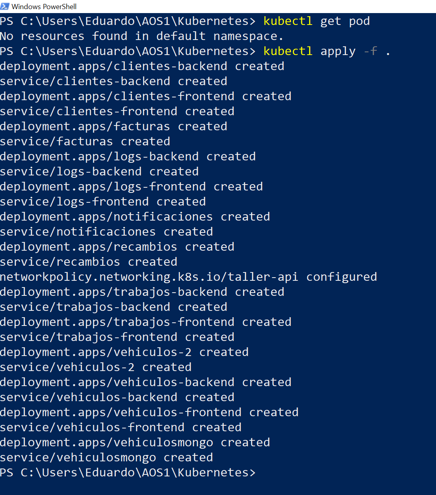
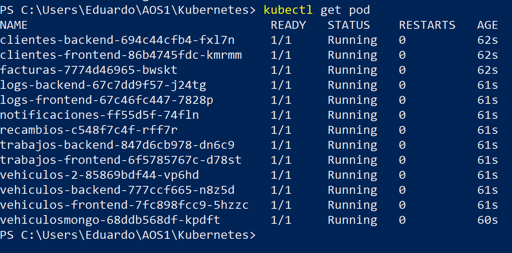
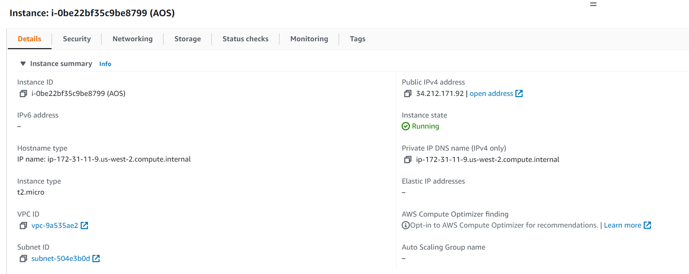
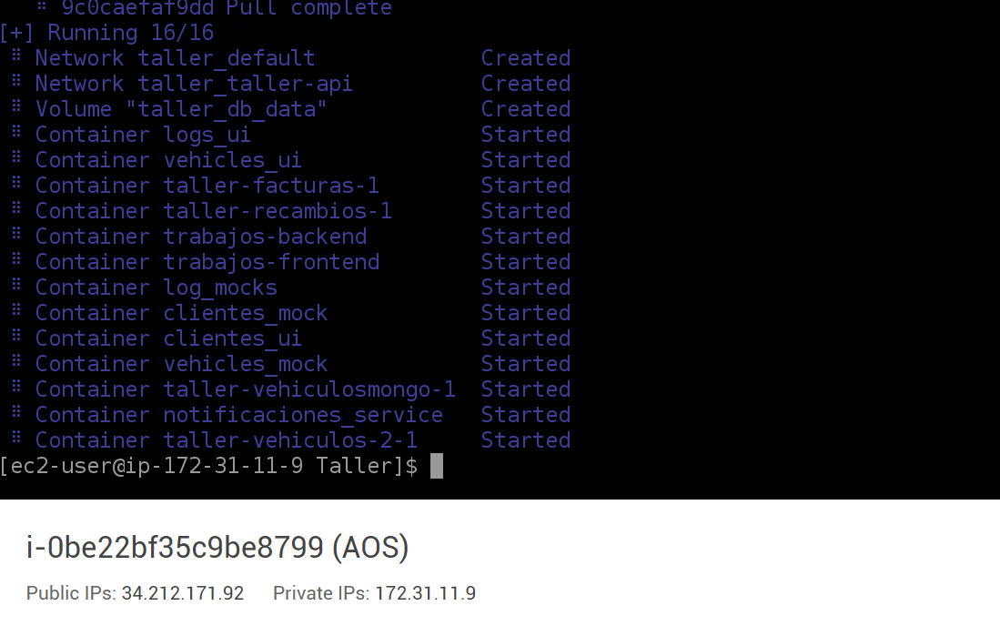
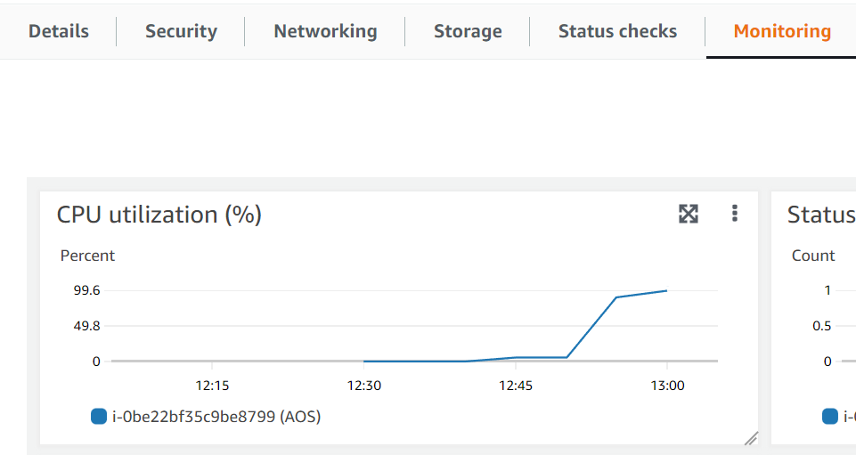

# Práctica 2. Consideraciones de diseño y despliegue


## Imagen Facturas

Realizamos el desarrollo de nuestro servicio correspondiente a la gestión y emisión de facturas de un taller mediante FastAPI y Python.

La aplicación desarrollada se despliega sobre una imagen de Python-3.9 de Docker. La persistencia se realiza utilizando un fichero Sqlite3, integrado dentro de la imagen por lo que no es necesario desplegar servicios adicionales para la base de datos.

La imagen se encuentra disponible en el siguiente  [enlace a DockerHub](https://hub.docker.com/repository/docker/eloz/grupo8facturas). El código se encuentra en la carpeta `server`.

Podemos utilizar esta imagen utilizando el comando:

`docker run --name <nombre> 80:80 eloz/grupo8facturas:latest`

Una vez arrancado el contenedor tendremos disponible la documentación de la API en `localhost:80\docs`


## Despliegue de servicios mediante Docker Compose

Tras analizar el resto de servicios desarrollados para el Taller realizamos la siguiente integración, disponible en la carpeta `Taller`: 

- **Servicio 1. Gestión de Clientes**
En el momento de escritura de este fichero no se encuentra ningún desarrollo ni referencia a ningún enlace de Docker Hub. Por tanto, para simular la integración del servicio clientes con el resto de servicios del taller utilizamos la especificación en OpenAPI que el equipo desarrollo en la primera práctica, mockeandola con Spotlight y utilizando de front end SwaggerUI.
Esta interfaz puede encontrarse, una vez desplegados todos los servicios, en `localhost:8005/`
- **Servicio 2. Gestión de Vehículos**
En el momento de escritura de este fichero existe una imagen en DockerHub que depende de una imagen de MongoDB.
Una vez integrada esta imagen observamos que no es funcional y, aunque despliega un servicio en Ubuntu, este no sirve ninguna web a través de ningún puerto. Por ello, al igual que en el servicio de clientes, utilizamos Spotlight Y Swagger para la realización del mock de la especificación realizada durante la primera práctica.
Este servicio esta disponible en `localhost:8006/`
- **Servicio 3. Gestión de Trabajos**
No hay imagen generada en DockerHub del servicio. Observamos que existe cierta implementación en su repositorio de GitHub con excasa documentación. Por este motivo generamos una instancia de Spotlight para el mockeo del servicio y una instancia de Swagger UI  basandonos en la implementación que tienen publicada en GitHub dentro del Moodle de la asignatura.
El servicio esta disponible en `localhost:8090`
- **Servicio 4. Gestión de Notificaciones**
Integramos la imagen facilitada por el equipo desde DockerHub.
Al inspeccionar la imagen utilizando el comando `exec` observamos que esta desarrollada en Flask e integra una base de datos en Sqlite3. No hay documentación del servicio pero tambien podemos comrpobar que utiliza el puerto 5000.
Una vez desplegado el servicio debería estar accesible en `localhost:7777/notificaciones/` pero la página devuelve un mensaje de error. Desde la consola del servicio aparece un error de SQL: tabla no encontrada.

- **Servicio 5. Gestión de Facturas**
Servicio desarrollado por el equipo. Desplegado utilizando FastAPI y Python en un contenedor de Docker.
Puede consultarse este servicio en `localhost:8000/factura`.
Además, el servicio ofrece una especificación en OpenAPI para realizar consultas en `localhost:8000/docs/`generada automáticamente gracias a FastAPI. Esta documentación sirve a su vez para realizar peticiones.
- **Servicio 6. Gestión de Recambios**
Integración realizada utilizando la imagen de DockerHub del equipo. No existe dependencia con otro servicio, su persistencia esta incluida en la imágen.
El servicio esta disponible en `localhost:8095`
- **Servicio 7. Gestión de Logs**
De los dos equipos encargados de la implementación del servicio ninguno ha publicado una imagen en DockerHub en el momento de escribir esta memoria. Por ello, utilizamos como mock la especificación en OpenAPI que el equipo desarrollo durante la primera parte de la práctica utilizando SpotLight y SwaggerUI. Está disponible en `localhost:8081` y `localhost:8001` para la interfaz de Swagger UI.

Podemos desplegarlo utilizando el comando `docker compose up -d` dentro de la carpeta `Taller`.
El despliegue total del taller, utilizando servicios y mocks, supone la creación de `13` contenedores de Docker. Al ser varias de las imagenes de gran tamaño dificulta el despliegue tanto en local como en servidores Cloud públicos debido al consumo de memoria.
## Despliegue mediante Kubernetes

Para realizar el despliegue en Kubernetes nos apoyamos en la herramienta [Kompose](http://kompose.io). De esta forma podemos generar los ficheros `.yaml` correspondientes al fichero `docker-compose.yml` del `Taller`.

Destacamos que, al no existir imagen en DockerHub de multiples servicios a integrar en el despliegue, nos hemos visto obligados a utilizar volumenes en los ficheros de Kubernetes. Estos volumenes necesitan una ruta absoluta para poder montar los ficheros de especificación necesarios. Esta ruta genera error al desplegarse desde otro dispositivo y es necesario cambiarla en los ficheros correspondientes.

Verificamos el funcionamiento del comando `kubectl apply -f .` dentro de la carpeta `Kubernetes` en las siguientes imagenes:

- Creación de 'pods' de Kubernetes

- Kubernetes funcionando tras ejecutar el comando `kubectl apply -f .`



## Despliegue en la nube pública de AWS mediante contenedores EC2

Elegimos AWS como nube pública en la que realizar el despliegue. Concretamente lanzamos una instancia EC2 con tamaño "micro", que se incluye en la prueba gratuita de AWS.



Una vez dentro de la instancia EC2 en la que hemos instalado AMI ejecutamos los siguientes comandos para instalar docker

```sh
sudo amazon-linux-extras install docker
sudo service docker start
sudo usermod -a -G docker ec2-user
```

Una vez instalado y funcionando, clonamos nuestro repositorio con

`git clone https://github.com/xhiibrids/AOS1`

Ahora sólo resta levantar los servicios con docker-compose y observamos como se inician.



Ahora sólo nos queda comprobar si podemos acceder, para eso creamos una regla ACL para permitir el tráfico entrante y comprobar en nuestro navegador si podemos alcanzar algún servicio.

Finalmente, tratamos de acceder a un servicio cualquiera. Sin embargo, la instancia t2.micro queda bloqueada al faltarle recursos como podemos observar. Esta limitación se debe a la capacidad de RAM y almacenamiento de la máquina EC2 gratuita, que solo posee 500MB de RAM.

